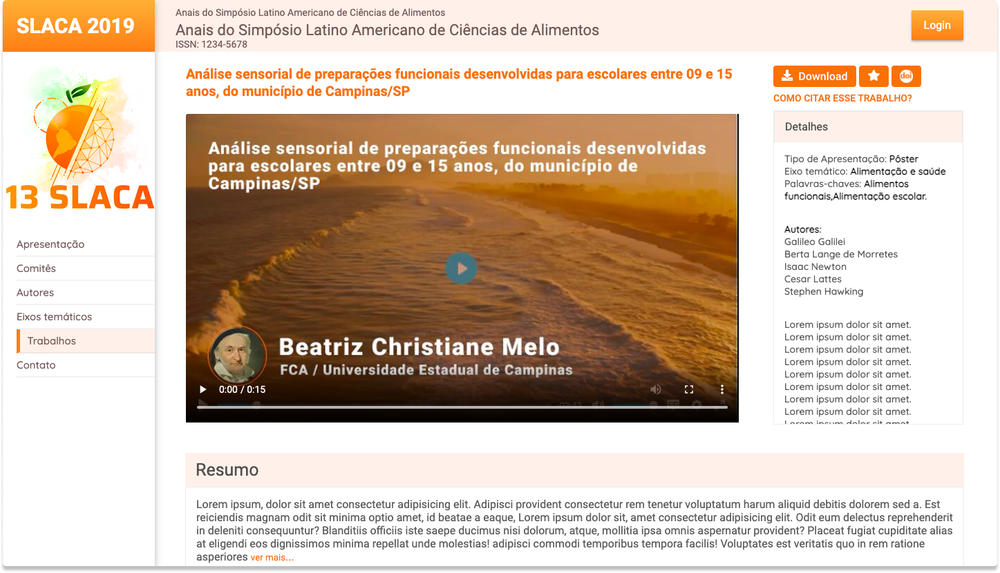

# Let it rain

> Exercício proposto durante a segunda etapa do processo seletivo para desenvolvedor front-end realizado pela Chuva inc.
-----------------------------------------------------------------------------------------------------------------------

<p align="center">
  
</p>

------------------------------------------------------------------------------------------------------------------------


## 🔧 Tecnologias e ferramentas utilizadas
- HTML5
- CSS3
- Javascript


## 🔖 O que foi proposto
A partir de um protótipo apresentado no Figma, me foi proposto a implementação de hmlt e css a este layout, seguindo-o com fidelidade e respeitando os seguintes tópicos:

- [x] Representação próxima ao layout original
- [x] Interatividade com os painéis solicitados no layout
- [x] Responsividade


## 💻 Acessando o website
Você pode acessar o projeto [clicando aqui.](https://caiokenedy.github.io/let-it-rain/)


## 🚀 executando o projeto

```bash
#### Clone o repositório
git clone https://github.com/CaioKenedy/let-it-rain/

#### Entre no diretório
cd let-it-rain
```
Depois disso, utilize uma ferramenta como o [Live Server](https://marketplace.visualstudio.com/items?itemName=ritwickdey.LiveServer) para criar um servidor local e executar o projeto.


## 📫 Contribuindo para <let-it-rain>

Para contribuir siga estas etapas:

1. Bifurque este repositório.
2. Crie um branch: `git checkout -b <nome_branch>`.
3. Faça suas alterações e confirme-as: `git commit -m '<mensagem_commit>'`
4. Envie para o branch original: `git push origin <nome_do_projeto> / <local>`
5. Crie a solicitação de pull.

Como alternativa, consulte a documentação do GitHub em [como criar uma solicitação pull](https://help.github.com/en/github/collaborating-with-issues-and-pull-requests/creating-a-pull-request).


### 📝 Licença

Esse projeto está sob licença. Veja o arquivo [LICENÇA](LICENSE.md) para mais detalhes.

[⬆ Voltar ao topo](#let-it-rain)<br>
